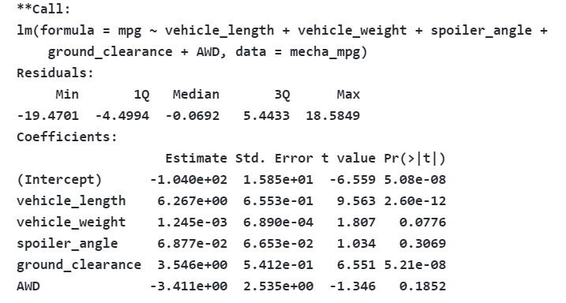

# MechaCar_Statistical_Analysis:

#Deliverable 1 Analysis:

1. Which variables/coefficients provided a non-random amount of variance to the mpg values in the dataset?

The variables vehicle length (2.60e-12) and the ground_clearance(5.21e-08) both provides the non-random amount of variance as both have low p-value (< 0.05). 

2. Is the slope of the linear model considered to be zero? Why or why not?

The slop of linear model is not considered zerio as there is a correlation between variables as we can conclude that there is an impact of independent vriables on dependent values. 

3. Does this linear model predict mpg of MechaCar prototypes effectively? Why or why not
The linear model preditcs MechaCar prototype is effetive as the mean is .7149 which is rounded to 72% is out of 100%.

