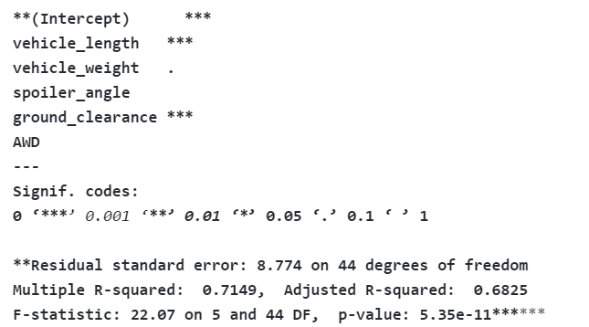
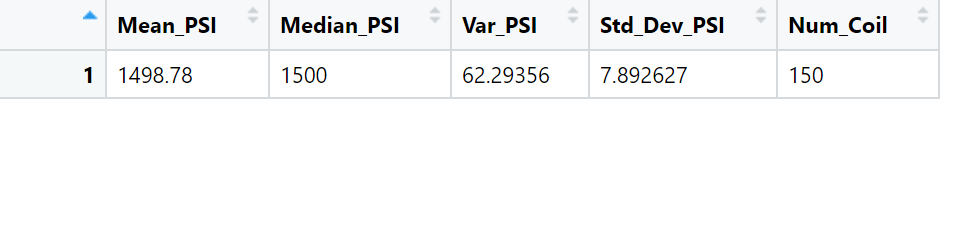
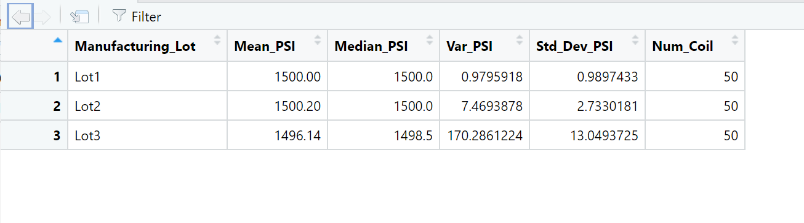

# MechaCar_Statistical_Analysis:

**#Deliverable 1 Analysis: Linear Regression to Predict MPG**

1. Which variables/coefficients provided a non-random amount of variance to the mpg values in the dataset?

The variables vehicle length (2.60e-12) and the ground_clearance(5.21e-08) both provides the non-random amount of variance as both have low p-value (< 0.05). 

2. Is the slope of the linear model considered to be zero? Why or why not?

The slop of linear model is not considered zerio as there is a correlation between variables as we can conclude that there is an impact of independent vriables on dependent values. 

3. Does this linear model predict mpg of MechaCar prototypes effectively? Why or why not
The linear model preditcs MechaCar prototype is effetive as the mean is .7149 which is rounded to 72% is out of 100%.

**#Deliverable 2 Analysis: Summary Statistics on Suspension Coils**

1. The design specifications for the MechaCar suspension coils dictate that the variance of the suspension coils must not exceed 100 pounds per square inch. Does the current manufacturing data meet this design specification for all manufacturing lots in total and each lot individually? Why or why not?

Using the functions --> total_summary <- mecha_coil %>% summarize(Mean_PSI=mean(PSI),Median_PSI=median(PSI),Var_PSI=var(PSI),Std_Dev_PSI=sd(PSI),Num_Coil=n(), .groups = 'keep') & lot_summary <- mecha_coil %>% group_by(Manufacturing_Lot) %>% summarize(Mean_PSI=mean(PSI),Median_PSI=median(PSI),Var_PSI=var(PSI),Std_Dev_PSI=sd(PSI),Num_Coil=n(), .groups = 'keep') the two below charts are created.

If we look at the requirement that variance of the suspension coils must not exceed 100 PSI it is met if we use the total summary vraince of 62.29356. On the other hand if we look at individuals lots we see that only lot 1(0.9795918) and lot 2(7.4693878) meet the requirement but lot 3(170.2861224) does not.

Image1: Total Summary

Iamge2: Individual lot summary

**#Deliverable 3 Analysis: T-Tests on Suspension Coils**

1. Briefly summarize your interpretation and findings for the t-test results. Include screenshots of the t-test to support your summary.

The part one of this deliverable is to se t.test() to determine if the PSI across ALL lots is statistically different from the pop. mean of 1,500 PSI. The results found below indicates that mean is not equal to 1500.

**One Sample t-test**
data:  mecha_coil$PSI
t = -1.8931, df = 149, p-value = 0.06028
alternative hypothesis: true mean is not equal to 1500
95 percent confidence interval:
 1497.507 1500.053
sample estimates:
mean of x 
  1498.78
  
Second part of this deliverable is to Use t.test() function 3 more times with subset()to determine if PSI for each manufacturing lot is statistically different from the pop. mean of 1,500 PSI and the result below shows for each lot below that mean does not equal 1500 PSI. 

**> t.test(lot1$PSI,mu=1500)**
data:  lot1$PSI
t = 0, df = 49, p-value = 1
alternative hypothesis: true mean is not equal to 1500
95 percent confidence interval:
 1499.719 1500.281
sample estimates:
mean of x 
     1500

**> t.test(lot2$PSI,mu=1500)**
data:  lot2$PSI
t = 0.51745, df = 49, p-value = 0.6072
alternative hypothesis: true mean is not equal to 1500
95 percent confidence interval:
 1499.423 1500.977
sample estimates:
mean of x 
   1500.2
   
**> t.test(lot3$PSI,mu=1500)**
data:  lot3$PSI
t = -2.0916, df = 49, p-value = 0.04168
alternative hypothesis: true mean is not equal to 1500
95 percent confidence interval:
 1492.431 1499.849
sample estimates:
mean of x 
  1496.14 
